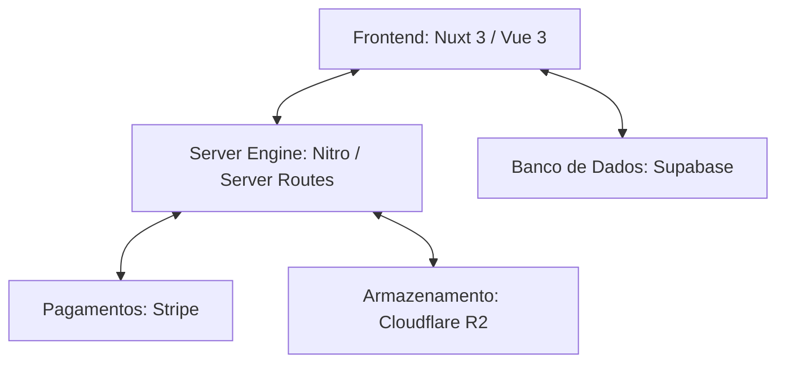

# Product Requirement Document (PRD) - Sistema UNA JOYA

Este documento descreve os requisitos de produto, especificações técnicas, funcionalidades e fluxos do sistema **UNA JOYA**, uma plataforma de e-commerce premium de joalheria artesanal.

---

## 1. Visão Geral do Produto

### 1.1 Contexto e Proposta de Valor
A **UNA JOYA** é uma marca de joalheria artesanal que comercializa peças exclusivas feitas à mão com pedras naturais. A plataforma web serve como uma vitrine virtual premium integrada a um sistema de pagamentos seguro, além de conter um painel administrativo exclusivo para gerenciar o catálogo de produtos e os conteúdos institucionais.

### 1.2 Objetivos do Sistema
- **Vitrine Atraente e Responsiva:** Oferecer uma experiência de compra visualmente rica, limpa e sofisticada, alinhada à estética de luxo.
- **Ciclo de Vida de Exposição Temporária:** Gerenciar automaticamente a exibição de peças baseando-se em um tempo de expiração configurável (evitando vitrines estáticas).
- **Checkout Simplificado:** Integrar uma experiência fluida de finalização de compras utilizando a infraestrutura do Stripe.
- **Painel Administrativo Autónomo:** Permitir que o administrador da marca gerencie o acervo de joias, faça upload de fotos e altere a história institucional ("Sobre Nós") sem intervenção técnica.

---

## 2. Arquitetura e Stack Tecnológica

O sistema foi desenvolvido utilizando uma arquitetura moderna e escalável, dividida em três pilares principais:

### 2.1 Tecnologias Utilizadas
- **Framework Principal:** [Nuxt 3](https://nuxt.com/) (Vue 3, TypeScript) para Renderização Híbrida.
- **Estilização (CSS):** [TailwindCSS](https://tailwindcss.com/) com design system customizado baseado em tokens premium.
- **Banco de Dados (BaaS):** [Supabase](https://supabase.com/) (PostgreSQL) para persistência de dados de produtos e conteúdo institucional.
- **Armazenamento de Mídia:** [Cloudflare R2](https://www.cloudflare.com/r2/) (compatível com S3) para armazenamento de fotos de produtos em alta definição.
- **Gateway de Pagamento:** [Stripe](https://stripe.com/) para processamento de transações via Pix e Cartão de Crédito em BRL.

---

## 3. Design System e Identidade Visual

A interface do sistema implementa uma estética minimalista, elegante e de alto padrão (Luxo), com foco em tipografia clássica e cores sóbrias.

### 3.1 Cores Principais
| Variável Tailwind | Valor Hexadecimal | Uso Recomendado |
| :--- | :--- | :--- |
| `primary` | `#090C0C` | Textos principais, botões de ação e cabeçalho. |
| `champagne-gold` | `#D4AF37` | Destaques de refinamento, ícones de sucesso, hover. |
| `soft-stone` | `#EAEAEA` | Bordas finas, planos de fundo de botões secundários. |
| `surface` | `#FCF8F8` | Fundo principal da página e das seções. |
| `secondary` | `#5F5F59` | Textos de apoio, legendas e parcelamento. |

### 3.2 Tipografia
- **Títulos (`font-display-lg`):** *EB Garamond* (Serifada) - Transmite tradição, exclusividade e elegância artística.
- **Corpo e Rótulos (`font-body-lg` / `font-label-caps`):** *Karla* (Sans-serif) - Oferece alta legibilidade para informações de produtos, preços e navegação técnica.

---

## 4. Requisitos Funcionais (Funcionalidades)

### 4.1 Vitrine Pública (Home / Loja)
- **Cabeçalho Fixo (`AppHeader`):** Barra de topo persistente contendo logotipo da marca e link rápido/ícone para o carrinho.
- **Menu Lateral (`AppDrawer`):** Drawer deslizante para navegação em dispositivos menores.
- **Banner Hero (`HeroBanner`):** Destaque visual de abertura com chamadas (CTA) institucionais.
- **Selo de Confiança (`TrustBadges`):** Exibição de garantias da loja (ex: frete grátis, parcelamento sem juros, segurança).
- **Grade de Coleções (`CollectionsGrid`):** Navegação rápida entre categorias e famílias de joias.
- **Mais Vendidos (`BestSellers`):**
  - Consome dados dinamicamente da tabela `products` do Supabase.
  - **Filtro Automático de Expiração:** Exibe apenas joias cujo tempo restante de exibição (`created_at` + `duration` em dias) seja maior que o instante atual.
  - **Cálculo de Parcelamento Dinâmico:** 
    - Produtos $\ge \text{R\$} \, 400,00$: Parcelamento em até **6x sem juros**.
    - Produtos $< \text{R\$} \, 400,00$: Parcelamento em até **3x sem juros**.
  - **Ação de Compra:** Botão "Comprar" adiciona o item ao carrinho e abre o popup de confirmação (`CartPopup`).

### 4.2 Gerenciamento de Carrinho (`useCart`)
O estado do carrinho de compras é gerenciado globalmente via composable reativo do Nuxt, com suporte para:
- Adicionar produtos ao carrinho (incrementando a quantidade se já existir).
- Ajustar quantidade (adicionar/remover unidades) diretamente no checkout.
- Exclusão de itens individualmente.
- Configuração de opção de "Embalagem para Presente" (`giftWrap`).
- **Cálculos Fiscais/Comerciais:**
  - **Subtotal:** Soma dos valores de todos os itens considerando suas respectivas quantidades.
  - **Desconto de 5%:** Aplicado sobre o subtotal para incentivar pagamento à vista (Pix/Cartão).
  - **Total:** Diferença entre o Subtotal e o Desconto de 5%.

### 4.3 Experiência de Compra e Checkout (`/checkout`)
- **Tela de Checkout Dedicada:** Layout responsivo otimizado. No desktop apresenta duas colunas (itens à esquerda, resumo fixo e ações à direita); no mobile exibe fluxo empilhado de fácil leitura.
- **Resumo Financeiro (`CheckoutSummary`):** Exibição do subtotal, campo simulador de frete (retorna "Grátis" após 1.2 segundos), cupom de desconto promocional e valor total do pedido.
- **Redirecionamento Stripe:** O botão de finalização dispara uma requisição `POST` para a API interna `/api/checkout`, gerando uma sessão no Stripe e redirecionando o cliente.
- **Páginas de Retorno:**
  - **Sucesso (`/checkout/success`):** Exibe mensagem elegante de agradecimento, limpa o carrinho (`resetCart()`) e informa que a compra foi processada.
  - **Cancelamento (`/checkout/cancel`):** Notifica falha ou desistência sem cobrar do cliente, permitindo retorno imediato ao carrinho.

### 4.4 Painel Administrativo Exclusivo (`/painel-exclusivo-unajoya`)
Acesso a uma interface protegida por URL para controle de conteúdo e produtos da loja:

1. **Aba de Produtos:**
   - **Métricas do Catálogo:** Painel com contadores de produtos ativos e produtos expirados.
   - **Formulário de Cadastro/Edição:** Criação ou modificação de produtos.
     - Upload de Imagem integrado ao Cloudflare R2 (`/api/upload`) ou seleção rápida de imagens mockadas de teste.
     - Definição do título, descrição, preço, estoque disponível, status de promoção (`promo`) e duração de exibição na loja (em dias).
   - **Listagem de Itens:** Grade de visualização de todos os produtos do banco com o status de expiração detalhado (ex: "Expirado", "24h restantes", "X dias restantes"), indicador visual para itens perto de expirar ($\le 2$ dias restantes) e botão de remoção/deleção definitiva.

2. **Aba "Carrossel":**
   - Controle dinâmico dos banners da homepage. Admins podem alterar fotos, títulos (com suporte a quebra de linha por html), legendas, botões de ação e alinhamento do texto.

3. **Aba "Lookbook (Faixa)":**
   - Controle dinâmico da faixa rápida (marquee) de fotos. Permite fazer upload de novas imagens verticais de estilo de vida, cadastrar uma descrição reativa (alt text) e ordenar a sequência do marquee infinito.

4. **Aba "Sobre Nós":**
   - Formulário para atualização do conteúdo institucional da marca.
   - Modifica os campos `title`, `content` e `image` da tabela `about_us` no Supabase, refletindo instantaneamente na seção sobre nós da home page pública.

---

## 5. Integrações de Back-End (Server API)

### 5.1 Endpoint `/api/checkout` (Método: `POST`)
- **Função:** Cria sessões de pagamento no Stripe Checkout.
- **Entrada:** Lista de produtos no carrinho contendo `name`, `price`, `quantity` e `image`.
- **Comportamento:**
  - Valida a consistência dos dados do carrinho.
  - Converte preços para centavos (requisito da API do Stripe).
  - Inicializa o SDK do Stripe com a chave secreta de ambiente (`STRIPE_SECRET_KEY`).
  - Identifica a URL do host de forma dinâmica para definir as rotas de retorno (`success_url` e `cancel_url`).
- **Retorno:** Retorna a URL da sessão do Stripe para redirecionamento.

### 5.2 Endpoint `/api/upload` (Método: `POST`)
- **Função:** Recebe arquivos e realiza o upload na nuvem.
- **Entrada:** Arquivo de imagem enviado via multipart/form-data.
- **Comportamento:**
  - Lê a imagem usando `readMultipartFormData`.
  - Inicializa o cliente `S3Client` com as credenciais do Cloudflare R2 de ambiente.
  - Gera um identificador único temporal (`uniqueId`) e formata o caminho da chave (ex: `products/1778970000000-abc123z.jpg`).
  - Executa a ação `PutObjectCommand` no bucket configurado.
- **Retorno:** Link público de CDN otimizado para renderização direta na vitrine.

---

## 6. Modelagem de Dados (Banco de Dados)

O banco de dados PostgreSQL expõe duas tabelas essenciais acessadas via Supabase:

### 6.1 Tabela `products`
| Nome da Coluna | Tipo SQL | Descrição |
| :--- | :--- | :--- |
| `id` | `bigint` (PK, Auto-incremento) | Identificador único do produto. |
| `created_at` | `timestamp with time zone` | Data e hora de inclusão da joia. |
| `name` | `text` | Nome comercial do produto. |
| `description` | `text` (Nullable) | Detalhamento das pedras e acabamento. |
| `price` | `numeric` | Preço de venda em BRL. |
| `stock` | `numeric` | Quantidade disponível em estoque. |
| `promo` | `boolean` | Flag de destaque promocional. |
| `duration` | `numeric` | Dias permitidos de exibição ativa (Default: 15). |
| `image` | `text` (Nullable) | URL da imagem hospedada no Cloudflare R2. |

### 6.2 Tabela `about_us`
| Nome da Coluna | Tipo SQL | Descrição |
| :--- | :--- | :--- |
| `id` | `bigint` (PK) | Identificador do bloco (normalmente `1`). |
| `title` | `text` | Título da seção sobre nós. |
| `content` | `text` | Texto institucional/História da marca. |
| `image` | `text` (Nullable) | Foto dos fundadores ou da oficina de fabricação. |

### 6.3 Tabela `hero_slides`
| Nome da Coluna | Tipo SQL | Descrição |
| :--- | :--- | :--- |
| `id` | `bigint` (PK, Auto-incremento) | Identificador único do slide. |
| `created_at` | `timestamp with time zone` | Data e hora de criação do slide. |
| `sort_order` | `integer` | Ordem de exibição (crescente). |
| `image` | `text` | URL da imagem de fundo. |
| `subtitle` | `text` | Legenda do slide (ex: "COLEÇÃO 2026"). |
| `title` | `text` | Título principal (suporta HTML). |
| `btn1` | `text` | Texto do primeiro botão. |
| `btn2` | `text` | Texto do segundo botão. |
| `align` | `text` | Alinhamento do texto e botões (Tailwind classes). |
| `active` | `boolean` | Flag indicando se o slide deve ser exibido. |

### 6.4 Tabela `lookbook_photos`
| Nome da Coluna | Tipo SQL | Descrição |
| :--- | :--- | :--- |
| `id` | `bigint` (PK, Auto-incremento) | Identificador único da foto. |
| `created_at` | `timestamp with time zone` | Data e hora de inclusão. |
| `image` | `text` | URL da foto vertical hospedada no R2. |
| `alt` | `text` | Descrição de acessibilidade (Alt text). |
| `sort_order` | `integer` | Ordem de exibição na faixa de fotos. |

---

## 7. Requisitos Não Funcionais

### 7.1 Segurança
- **Ocultação de Credenciais:** Tokens do Cloudflare R2, Stripe Secret Key e chaves privadas do banco residem estritamente em variáveis de ambiente (`.env`) no lado do servidor, impedindo vazamentos na aplicação cliente.
- **Supabase Anon Key:** A conexão cliente do banco de dados opera sob a política de chaves anônimas seguras do Supabase.

### 7.2 Performance e UX
- **Carregamento Assíncrono:** Os componentes utilizam o estado de carregamento de esqueleto (*Skeleton Loader*) para atenuar a percepção de tempo enquanto os dados são recuperados das tabelas.
- **Micro-animações:** Efeitos de hover suaves nas imagens (zoom), modais animados com curvas de aceleração orgânica (`cubic-bezier`), e transições de esvanecimento (`fade-in`) para melhor fluxo cognitivo.
- **Layout Fluido:** Suporte nativo a telas Ultra-Wide (até `2560px` - 4K) e telas de smartphones compactos, mantendo margens de leitura confortáveis.
